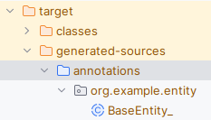
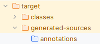
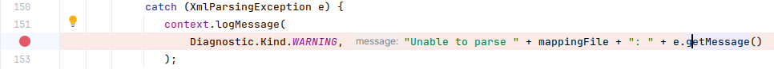

# Hibernate orm.xml Java 11 issue

This project is a showcase of an issue I phase as I want to migrate a java8 project to java 11.

## Context

On a project, we have an orm.xml file for hibernate mapping. This project is actually build and run in java 8. We want to upgrade it to java 11 (and later to java 17).

## With JDK 8 

When using a jdk8 for the maven build ``mvn clean install``. StaticModel class are perfectly generated in "target/generated-sources/annotations".

## With JDK 11

When using a jdk11 for the maven build ``mvn clean install``. StaticModel class are not generated and "target/generated-sources/annotations" is empty. 

No errors are present in maven log.

### Maven debug search

With a debug point in _org.hibernate.jpamodelgen.xml.JpaDescriptorParser#L153_. I manage to retrieve the real error message.

**Error message**
> Implementation of JAXB-API has not been found on module path or classpath.

Du to the removal of jaxb in Java 11

## How to fix ?